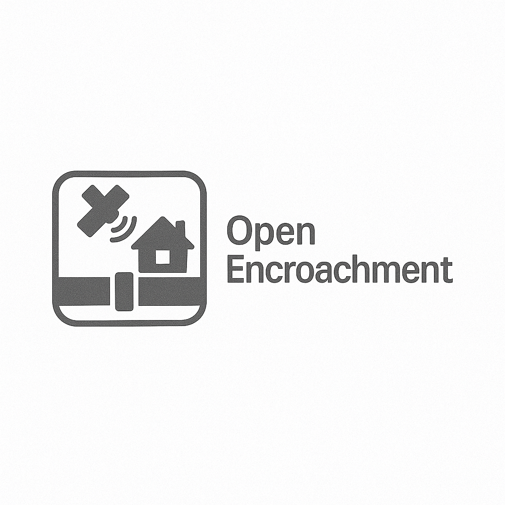

  

# OpenEncroachment

OpenEncroachment is an OpenAI Agents SDK integrated threat detection system that fuses multi-sensor data (satellite imagery, ground sensors, aerial surveillance, social media/NLP) and coordinates responses to protect natural assets and critical infrastructure.

Capabilities:
- Data ingestion from satellite, ground sensors, aerial data, and social streams
- Multi-source data fusion with geospatial alignment and time-windowing
- Machine learning-based threat detection with online learning (partial_fit)
- NLP pipeline for social/news signals using TF-IDF + linear models
- Geofencing with real-time GPS monitoring
- Threat classification with severity scoring across environmental, legal, and operational risk dimensions
- Evidence collection with timestamp verification and chain-of-custody hashing
- Automated notifications with secure packaging to a local outbox and optional webhooks
- Predictive analytics for high-risk locations/time periods
- Incident tracking and case management with SQLite
- Mobile sync endpoints (JSON packages) for offline field team usage (file-based simulation)

Quick start:
1) Python 3.10+
2) Create a virtual environment and install
   - macOS/Linux
     - python3 -m venv .venv
     - source .venv/bin/activate
   - Windows (PowerShell)
     - py -3 -m venv .venv
     - .venv\Scripts\Activate.ps1
3) Install
   - pip install -U pip
   - pip install -e .
4) Run with sample data
   - open-encroachment run-pipeline --config config/settings.yaml --sample-data

CLI overview:
- open-encroachment run-pipeline: Orchestrate ingestion → fusion → detection → notify
- open-encroachment ingest: Import data by source
- open-encroachment predict: Generate risk forecasts
- open-encroachment case: Manage incidents and case lifecycle
- open-encroachment evidence: Verify evidence ledger integrity

Repo layout:
- src/open_encroachment/: Core Python package
- config/: Configuration (YAML)
- data/: Sample data inputs
- outbox/: Locally written notifications and secure packages
- tests/: Unit tests

Configuration:
- settings.yaml: main configuration, loaded by default. Reasonable defaults are embedded, so it is optional.
- dispatcher.yaml: optional. If present in `config/dispatcher.yaml` (or provided via `dispatch_config_path`), it augments `dispatch` with webhook/TLS options.
  - Example:
    - mode: webhook
    - webhook:
      - url: https://example.org/webhook
      - timeout: 10.0
      - ca_bundle: /path/to/ca.pem
      - client_cert: /path/to/cert.pem
      - client_key: /path/to/key.pem
      - headers: {X-Api-Key: secret}

Security and privacy:
- No external services are contacted unless configured. By default, notifications are sealed and written to outbox/.
- Keys for signing are generated on first run and stored under .secrets/ (gitignored).

License: MIT

## Development

We use uv for environment management and Hatch for build/packaging.

- Install uv: curl -LsSf https://astral.sh/uv/install.sh | sh
- Sync env (with dev + geo extras): ~/.local/bin/uv sync --all-extras --dev
- Run tests quickly (one env): ~/.local/bin/uvx tox -q -e py311
- Full matrix: ~/.local/bin/uvx tox -q
- Lint: ~/.local/bin/uvx ruff check .
- Type-check: ~/.local/bin/uvx mypy --strict src/open_encroachment
- Format: ~/.local/bin/uv run hatch run dev:format
- Pre-commit: ~/.local/bin/uvx pre-commit run -a (install with `~/.local/bin/uvx pre-commit install`)

Agents:
- export OPENAI_API_KEY before using the agent
- Run agent: ~/.local/bin/uv run open-encroachment agent --help

Datasette:
- Ensure artifacts/case_manager.db exists (run pipeline once)
- Serve: ~/.local/bin/uv run datasette -c datasette.yaml --reload
- Visit: http://127.0.0.1:8001

llm CLI (optional):
- ~/.local/bin/uvx llm install llm-openai
- ~/.local/bin/uvx llm keys set openai
- Example: ~/.local/bin/uvx llm -m openai/gpt-4o-mini "Summarize:" < artifacts/predictions/risk_map.csv
